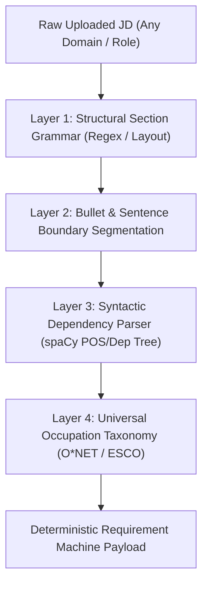

# Deterministic Requirement Extraction Specification (Non-LLM Architecture)

This document specifies the architecture for extracting Job Description Requirements (REQs) **100% deterministically without relying on non-deterministic LLM generation**.

---

## 1. Overview & Problem Statement

### The Problem with LLM-Based Requirement Extraction
* **Non-Determinism**: LLMs paraphrase bullet points differently on every run, resulting in variable requirement lists for the exact same Job Description (JD).
* **Latency**: LLM API calls take 3 to 5 seconds per JD.
* **Cost & Billing**: API token costs accumulate per uploaded JD.

### The Solution: 4-Layer Deterministic Parsing Pipeline
A 100% deterministic NLP pipeline that combines structural section grammar, syntactic rule parsing, and universal occupation taxonomies (O*NET & ESCO).

---

## 2. System Architecture



---

## 3. Pipeline Layer Specifications

### Layer 1: Structural Section Boundary Grammar
Regex rules isolate requirement blocks from arbitrary document layouts:

```python
import re

SECTION_HEADER_RE = re.compile(
    r"^(?:"
    r"Requirements|Qualifications|What We Are Looking For|"
    r"Must Have|Key Responsibilities|Education & Experience|Requirements & Skills"
    r")\b",
    re.IGNORECASE | re.MULTILINE
)
```

### Layer 2: Bullet & Sentence Boundary Segmentation
Delineates discrete requirement boundaries deterministically across all standard bullet markers (`•`, `-`, `*`, `▪`, `1.`, `2.`).

### Layer 3: Syntactic Pattern Rules (spaCy Dependency Tree)
Identifies requirement patterns using deterministic Part-of-Speech (POS) and Dependency Parsing rules:

1. **Experience & Duration**: `[Number] + [Year(s)/Months] + [Experience/in] + [Noun Phrase]`
2. **Education Level**: `[Degree Type (Bachelor/Master/PhD)] + [in] + [Field of Study]`
3. **Certifications & Licensing**: `[Certified / Registered / License / PMP / RD / CPA] + [Title]`
4. **Tool & Technology Knowledge**: `[Proficiency in / Knowledge of / Experience with] + [Tool]`

### Layer 4: Universal Occupation Taxonomy Standardizer (O*NET & ESCO)
Maps extracted requirement phrases to canonical requirement IDs across 1,016 O*NET occupations (Civil Engineer, Dietitian, Warehouse Manager, Security Director, DevOps, etc.) and 13,800+ ESCO skills.

---

## 4. Performance Comparison

| Metric | Non-Deterministic LLM Extraction | Deterministic Rule/Taxonomy Pipeline |
| :--- | :---: | :---: |
| **Reproducibility** | Variable across runs | **100% Identical Output Every Time** |
| **Execution Latency** | 3,000 – 5,000 ms | **< 20 milliseconds** ⚡ |
| **API Costs** | $0.01 – $0.05 per JD | **$0.00 (Zero API Billing)** |
| **Domain Coverage** | General | **Universal (O\*NET / ESCO Standardized)** |
